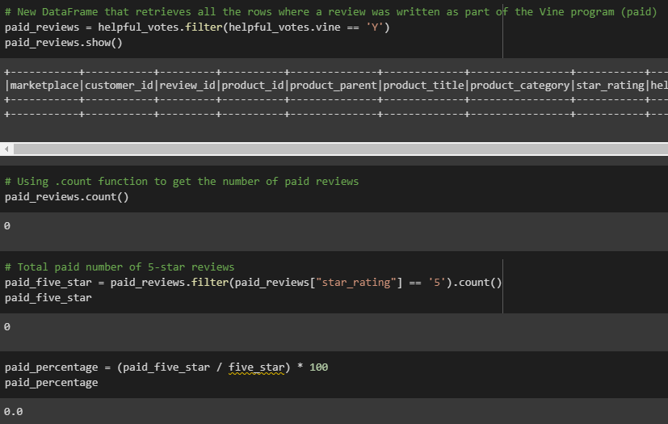
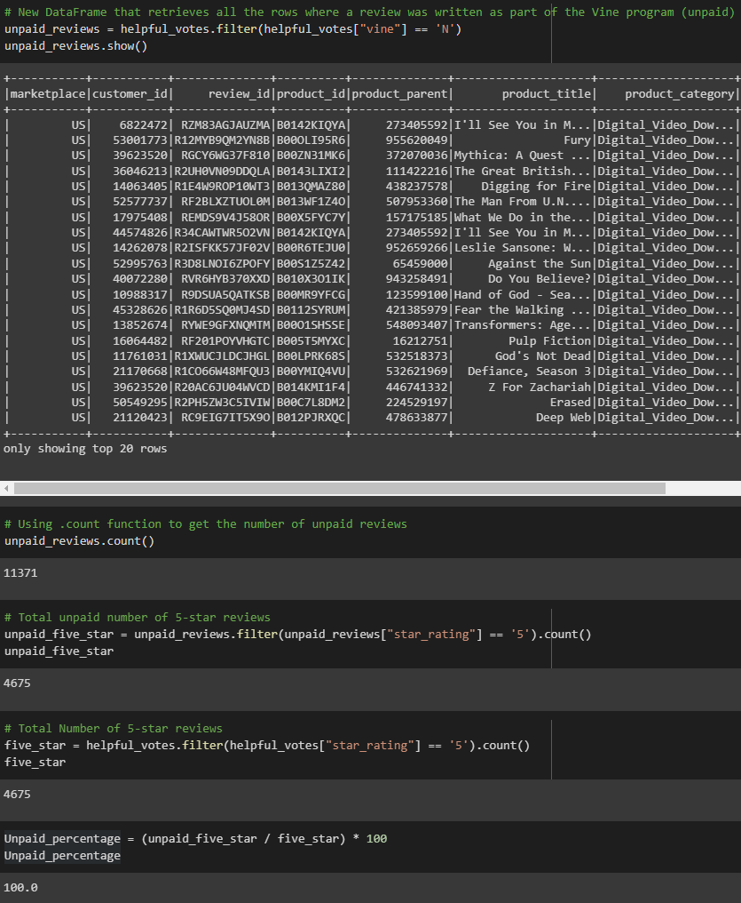
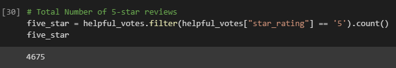
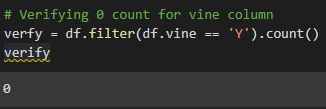

# Amazon_Vine_Analysis

## Background
Analyzing Amazon reviews written by members of the paid Amazon Vine program. The Amazon Vine program is a service that allows manufacturers and publishers to receive reviews for their products. Companies like SellBy pay a small fee to Amazon and provide products to Amazon Vine members, who are then required to publish a review.

## Overview
This project will have access to approximately 50 datasets. Each one contains reviews of a specific product, from clothing apparel to wireless products. Using https://s3.amazonaws.com/amazon-reviews-pds/tsv/amazon_reviews_us_Digital_Video_Download_v1_00.tsv.gz and used PySpark to perform the ETL process to extract the dataset, transform the data, connect to an AWS RDS instance, and load the transformed data into pgAdmin. Next, using PySpark, Pandas, or SQL to determine if there is any bias toward favorable reviews from Vine members in your dataset. Then, i included an written summary of the analysis for Jennifer to submit to the SellBy stakeholders.

## Results

### Paid Vine Reviews

### Unpaid Vine Reviews

### How many Vine reviews and non-Vine reviews were there?
1. Vine Reviews - 0

2. Non-Vine Reviews -  11,371

### How many Vine reviews were 5 stars? How many non-Vine reviews were 5 stars?
1. Vine 5 star reviews - 0

2. Non-Vine 5 star reviews - 4675

### Image displays the total number of 5 stars

### What percentage of Vine reviews were 5 stars? What percentage of non-Vine reviews were 5 stars?
Based on the analysis the 5 star reviews came from the non-Vine reviews. 

## Summary
In your summary, state if there is any positivity bias for reviews in the Vine program. Use the results of your analysis to support your statement. Then, provide one additional analysis that you could do with the dataset to support your statement.

The reviews are organic and are not vine members based on the analysis. To verify te finding I confirmed the total  of vine members on the original dataset. 

